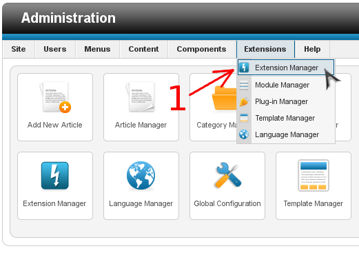
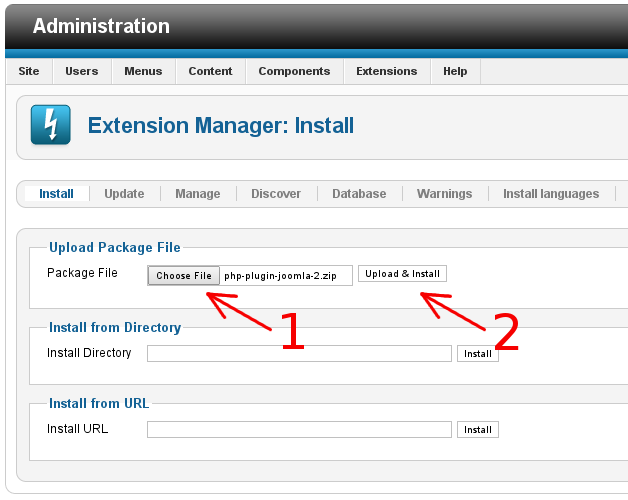
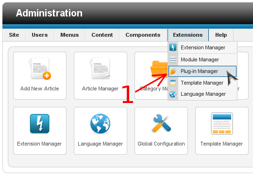
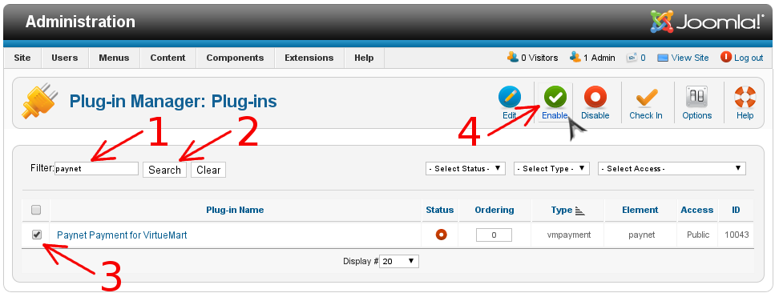
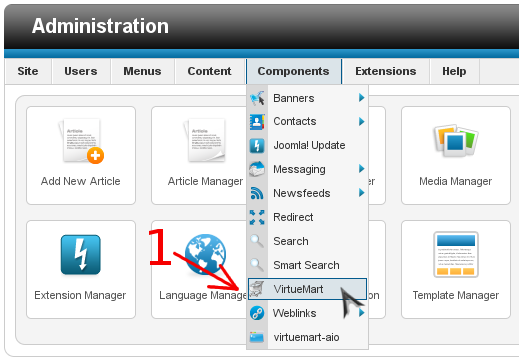
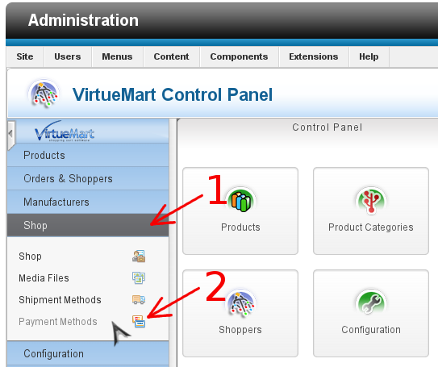
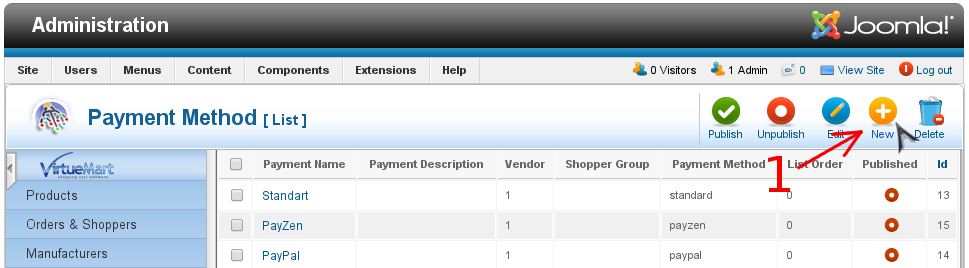
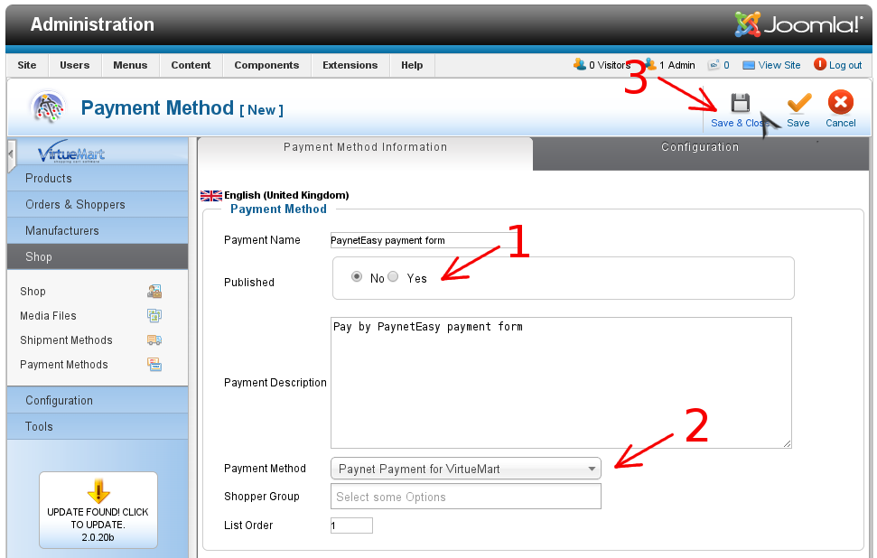

# Установка плагина

1. [Получите пакет с плагином](../README.md#get_package)
2. Перейдите в панель администрирования Joomla
3. Перейдите в менеджер расширений (стрелка #1)

    
4. Установите пакет с плагином
    1. Откройте диалог поиска файла (стрелка #1)
    2. Найдите и выберите пакет с плагином
    3. Загрузите и установите пакет с плагином (стрелка #2)

    
5. Перейдите в менеджер плагинов (стрелка #1)

    
6. Включите плагин
    1. Введите в поле поиска `paynet` (стрелка #1)
    2. Выполните поиск (стрелка #2)
    3. Выберите плагин в списке (стрелка #3)
    4. Включите плагин (стрелка #4)

    
7. Перейдите в VirtueMart (стрелка #1)

    
8. Перейдите к списку методов оплаты
    1. Выберите на левой панели раздел "Shop" (стрелка #1)
    2. В открывшемся списке выберите пункт "Payment Methods" (стрелка #2)

    
9. Нажмите на кнопку "New" (стрелка #1)

    
10. Создайте новый платежный метод
    1. Заполните форму для создания нового платежного метода
    2. Убедитесь, что платежный метод не опубликован (стрелка #1)
    3. Убедитесь, что выбран платежный метод Paynet (стрелка #2)
    4. Сохраните платежный метод (стрелка #3)

    