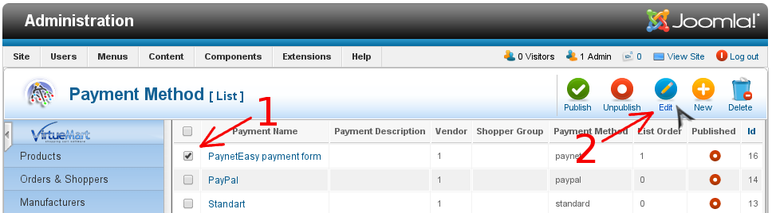
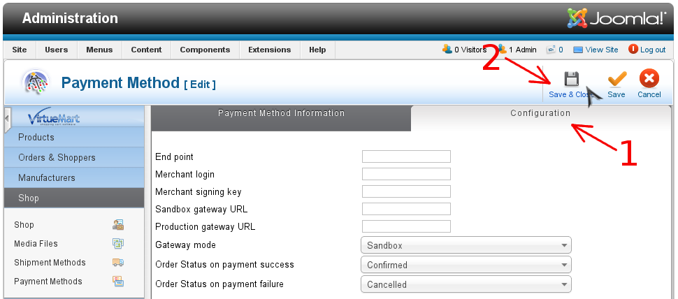
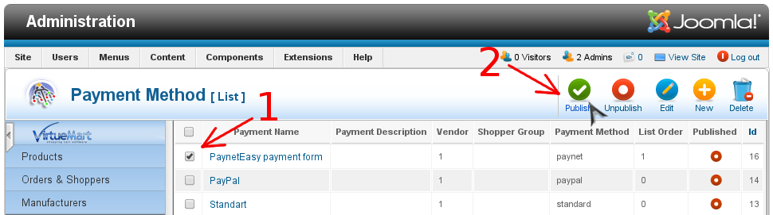

# Настройка плагина

1. Перейдите в панель администрирования Joomla
2. Перейдите в VirtueMart (стрелка #1)

    
3. Перейдите к списку методов оплаты
    1. Выберите на левой панели раздел "Shop" (стрелка #1)
    2. В открывшемся списке выберите пункт "Payment Methods" (стрелка #2)

    
4. Откройте платежный метод для редактирования
    1. Выберите платежный метод в списке (стрелка #1)
    2. Нажмите кнопку "Edit" (стрелка #2)

    
5. Заполните настройки плагина
    1. Переключите форму настройки на "Configuration" (стрелка #1)
    2. Заполните поля ввода для настроек
    3. Сохраните настройки плагина (стрелка #2)

    
6. Опубликуйте платежный метод
    1. Выберите платежный метод в списке (стрелка #1)
    2. Опубликуйте платежный метод (стрелка #2)

    