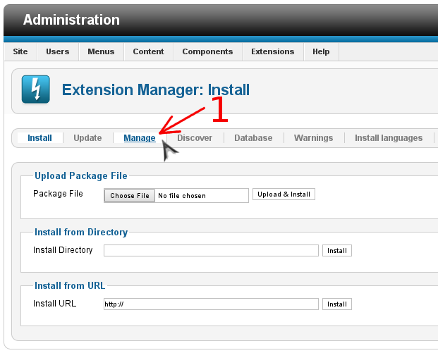
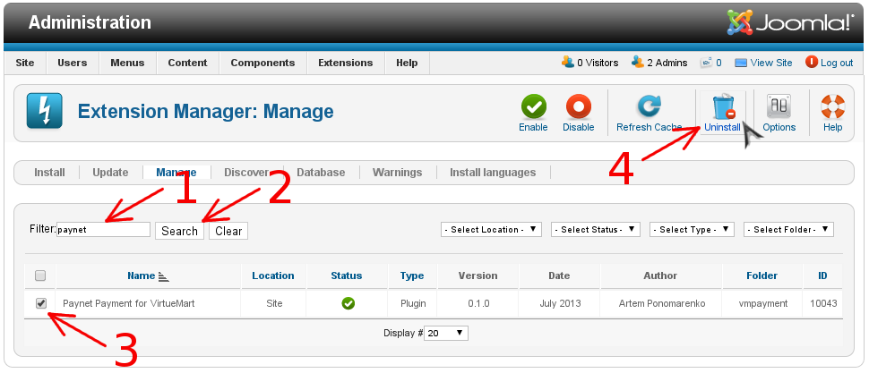

# Удаление плагина

1. Перейдите в панель администрирования Joomla
2. Перейдите в менеджер расширений (стрелка #1)

    
3. Перейдите к панели управления расширениями (стрелка #1)

    
4. Удалите плагин
    1. Введите в поле поиска `paynet` (стрелка #1)
    2. Выполните поиск (стрелка #2)
    3. Выберите плагин в списке (стрелка #3)
    4. Удалите плагин (стрелка #4)

    